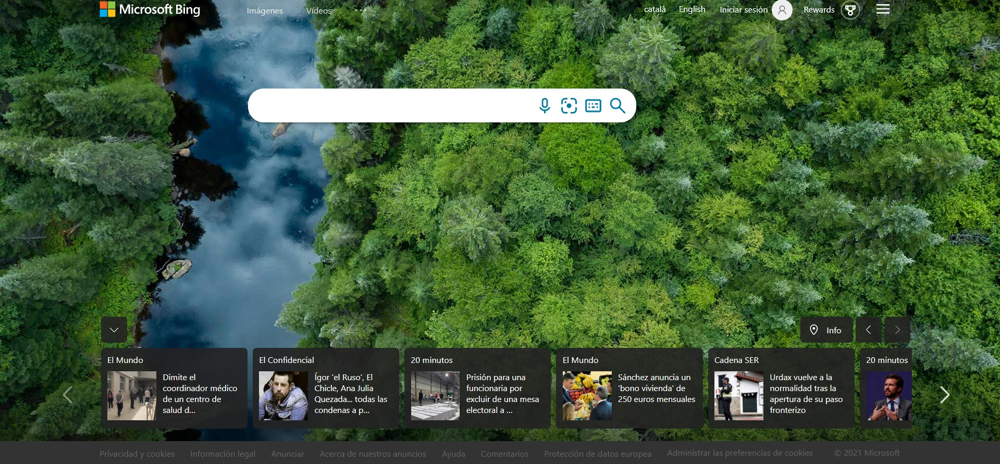
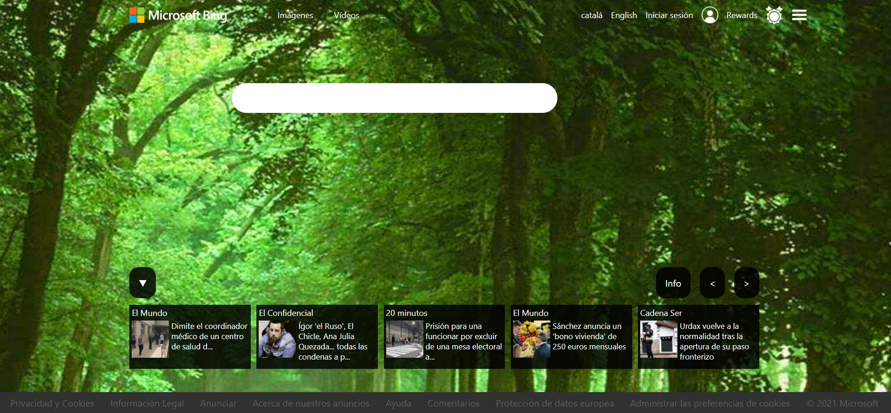

# Copia_Bing

## Realizamos una copia del diseño de la página de Bing.

Usamos `display:grid` para hacer la estructura de la página

Para colocar cada elemento en la posición que deseamos dentro de esa estructura usamos `display:flex`.

Usamos 15 elementos `div` dentro del elemento `container` para diseñar la web.

### -Diseño original de Bing:

### -Diseño realizado en el reto:
